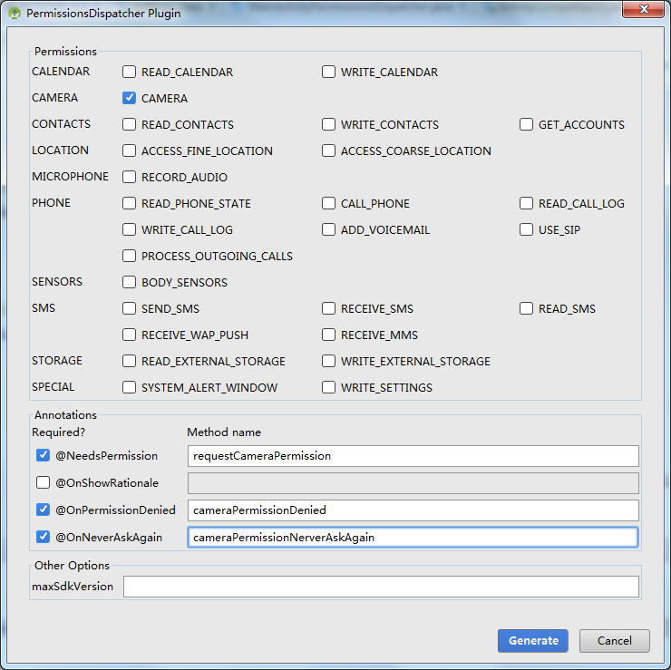
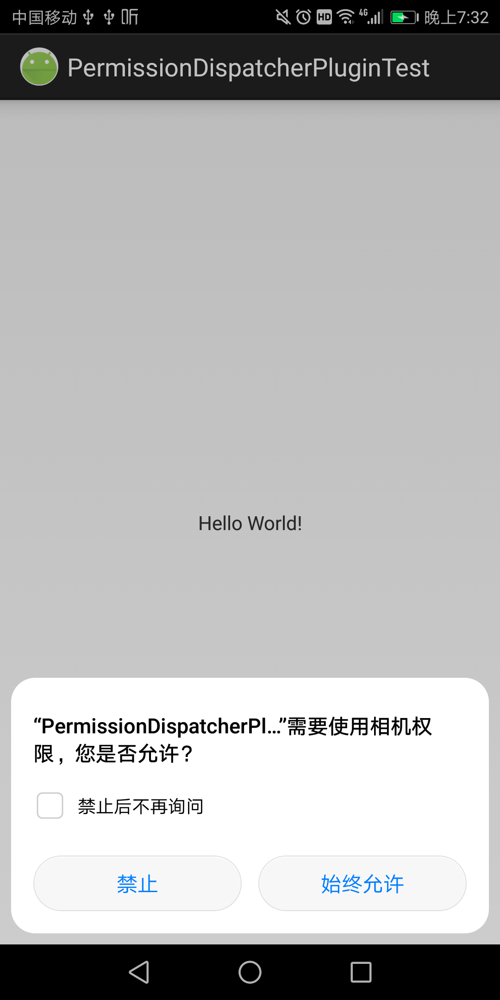

# PermissionDispatcher Plugin Demo
PermissionDispatcher Plugin

很方便的添加自动申请权限代码
. 如果用户选择同意，直接使用
. 如果用户拒接
### 1、在Android Studio中添加插件
##### 方式1：官网下载
https://plugins.jetbrains.com/plugin/8349-permissionsdispatcher-plugin
##### 方式2：离线下载
权限plugin（1.4.7版本）存放在本项目“app/plugin/” 目录里面了

### 2、在Android Studio中添加一个测试权限
以申请摄像头为例： 
<uses-permission android:name="android.permission.CAMERA"/>

### 3、添加注释代码
##### 右键-》菜单选择generate-》菜单选择 generate running permission

### 4、在自动生成的代码中添加

    @NeedsPermission({Manifest.permission.CAMERA})
    void requestCameraPermission() {
        Log.i(TAG, "requestCameraPermission succeed... ");
        Toast.makeText(this,"开启摄像头权限成功", Toast.LENGTH_LONG).show();
    }

    @OnPermissionDenied(Manifest.permission.CAMERA)
    void cameraPermissionDenied() {
        Log.i(TAG, "deniedCameraPermission ... ");
    }

    @OnNeverAskAgain(Manifest.permission.CAMERA)
    void cameraPermissionNerverAskAgain() {
        Log.i(TAG, "onCameraNeverAskAgain ... ");
        new AlertDialog.Builder(this)
                .setPositiveButton("朕亲去开启", new DialogInterface.OnClickListener() {
                    @Override
                    public void onClick(DialogInterface dialog, int which) {
                        Intent intent = new Intent(Settings.ACTION_APPLICATION_DETAILS_SETTINGS);
                        Uri uri = Uri.fromParts("package", getPackageName(), null);
                        intent.setData(uri);
                        startActivity(intent);
                    }
                })
                .setNegativeButton("取消", new DialogInterface.OnClickListener() {
                    @Override
                    public void onClick(DialogInterface dialog, int which) {
                        dialog.cancel();
                    }
                })
                .setCancelable(false)
                .setMessage("需要摄像头权限，陛下您已经设置拒接开启，并勾选了不再提醒")
                .show();

    }
### 5、手动添加处理结果
        @Override
        public void onRequestPermissionsResult(int requestCode, @NonNull String[] permissions, @NonNull int[] grantResults) {
            super.onRequestPermissionsResult(requestCode, permissions, grantResults);
    
            Log.i(TAG, "onRequestPermissionsResult requestCod = " + requestCode + ", grantResults = " + grantResults);
            MainActivityPermissionsDispatcher.onRequestPermissionsResult(this, requestCode, grantResults);
        }
### 6、在被调用出这样写(比如点击按钮)
        findViewById(R.id.id_auto_request_permission).setOnClickListener(new View.OnClickListener() {
            @Override
            public void onClick(View view) {
                Log.i(TAG, "call requestCameraPermission 1 ");
                MainActivityPermissionsDispatcher.requestPermissionWithCheck(MainActivity.this);
                Log.i(TAG, "call requestCameraPermission 2 ");
            }
        });
        
### 7、结果

 

### 8、总结
通过此方法添加的权限，如果没有权限，则不执行 注解为requestCameraPermission的函数，确保安全。
demo中：
- 如果用户拒接，下次调用还会申请权限
- 如果用户选了“不再提醒”，再次调用需要权限的函数，则还会提示，此时引导用户手动打开权限，直接跳转到设置页面